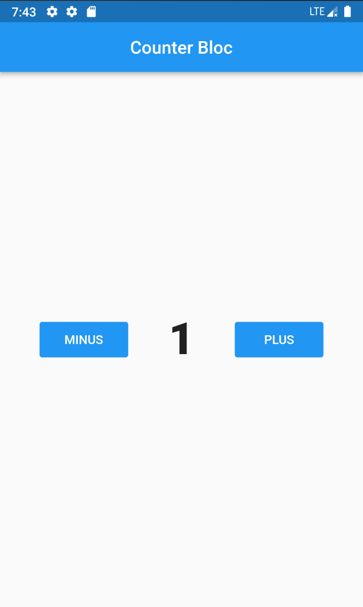

# counter_bloc

A new Flutter project.

## Getting Started

This project is a starting point for a Flutter application.

A few resources to get you started if this is your first Flutter project:

- [Lab: Write your first Flutter app](https://flutter.dev/docs/get-started/codelab)
- [Cookbook: Useful Flutter samples](https://flutter.dev/docs/cookbook)

For help getting started with Flutter, view our
[online documentation](https://flutter.dev/docs), which offers tutorials,
samples, guidance on mobile development, and a full API reference.

=====
Git initialization
=====

1. Create a new repository
2. Open Project Terminal
3. git init
4. git add .
5. git remote add origin https://github.com/MunirQasem/counter_bloc.git
6. git commit -m "initial commit"
7. git push -u origin master

=====
How to work with Git
=====
-> local:

1. Checkout master 

2. Update master 

3. Create branch from master 

4. Code … 

5. Commit 

6. Checkout master 

7. Update master 

8. Check out your local branch 

9. Merge master with my current branch 

10. Push 

-> Remote

11. Compare & pull request 

12. Create pull request 

13. Merge pull request 

14. Confirm merge 
